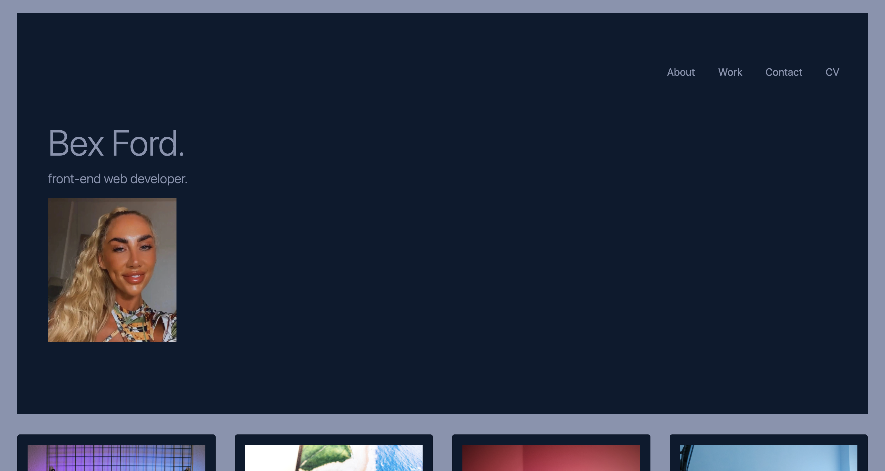
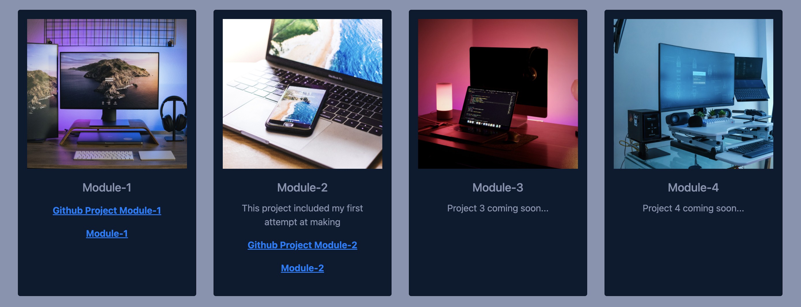

# Bootstrap-Portfolio

## Description 

- My motivation for this project was to build a portfolio profile to showcase my work using Bootstrap. 

Please see below a screenshot of the landing page that i have created. 

I made sure that my name was visible with an updated photo of myself was inserted into the webpage as you can see in the image.

I made sure that by adding the navigation links to the top right side of the page you can click any link and it would take the user to that specific part of the page.

- I built this project because when i complete this bootcamp course it will be a platform to present the work that i have done for future job prospects. 

- When vising the page the user will be able visit the link (CV). When clicked a PDF of my CV will load. The user will also be able to click the links and it will take them directly to that specific section.

- The image below is a grid layout using Bootstrap (card).

The image below shows the footer element of the page where i have added icons of both Gitub and Linkedin. When these icons are clicked it will open a separate page to both links. I have also created a hover effect using CSS.

- What i learned from completing this project was how to build a site using Bootstrap.

- What makes my project stand out is that it is simple but effective. I believe the colour contrast is very good and makes it easy for the user to see correctly. I have followed the instructions given for this project to the best of my current ability. The functionality of the page works very well when i have tested it.

## GitHub 

https://github.com/bex-ford/Bootstrap-Portfolio

## Licence 

NONE